<div align="center">

<!--
  GitHub profile README — animated SVGs only (no JS).
  Regenerate: python scripts/generate_all.py
  Config:     config.py
-->



<br/>


<br/><br/>

<h3><code>kenzzhood@github ~ $ ./contributions.sh</code></h3>



<br/><br/>

<h3><code>kenzzhood@github ~ $ whoami</code></h3>

<table>
  <tr>
    <td valign="top" width="370">
      
    </td>
    <td valign="top" width="490">
      
    </td>
  </tr>
</table>

<br/>


<br/><br/>

<h3><code>kenzzhood@github ~ $ cat research.md</code></h3>

<p>
  <b>Computer Vision</b> · <b>Gaussian Splatting</b> · <b>3D Reconstruction</b><br/>
  <b>Spatial Computing</b> · <b>Robotics</b> · <b>Generative AI</b> · <b>LLMs</b> · <b>AI Agents</b>
</p>

<p><i>Building AI-powered Spatial Computing, Computer Vision, XR, and Generative AI products.</i></p>

<br/>

<h3><code>kenzzhood@github ~ $ ls tech/</code></h3>

<p>
  <code>Python</code>&nbsp;
  <code>C++</code>&nbsp;
  <code>TypeScript</code>&nbsp;
  <code>JavaScript</code>&nbsp;
  <code>C#</code>&nbsp;
  <code>Java</code>
</p>

<p>
  <code>React</code>&nbsp;
  <code>React Native</code>&nbsp;
  <code>FastAPI</code>&nbsp;
  <code>Unity</code>&nbsp;
  <code>OpenCV</code>&nbsp;
  <code>PyTorch</code>&nbsp;
  <code>TensorFlow</code>&nbsp;
  <code>ROS</code>&nbsp;
  <code>Docker</code>
</p>

<br/>

<h3><code>kenzzhood@github ~ $ ./projects.sh --featured</code></h3>

</div>

<table>
  <tr>
    <td width="50%">
      <h4><a href="https://github.com/kenzzhood/AutoOps">AutoOps</a></h4>
      Autonomous observability CLI — Splunk + OpenTelemetry + AI RCA
    </td>
    <td width="50%">
      <h4><a href="https://github.com/kenzzhood/Atoms-Vision-Audit">Atoms Vision Audit</a></h4>
      Computer-vision delivery &amp; quality audit tooling
    </td>
  </tr>
  <tr>
    <td width="50%">
      <h4><a href="https://github.com/kenzzhood/AuraFit">AuraFit</a></h4>
      AI fitness experience
    </td>
    <td width="50%">
      <h4><a href="https://github.com/kenzzhood/MOOTVR">MOOTVR</a></h4>
      VR moot-court simulator for law students
    </td>
  </tr>
  <tr>
    <td width="50%">
      <h4><a href="https://github.com/kenzzhood/Health-Intellect">Health Intellect</a></h4>
      Unified AI healthcare records &amp; consults
    </td>
    <td width="50%">
      <h4><a href="https://github.com/kenzzhood/3D-Hand-Tracking">3D Hand Tracking</a></h4>
      Real-time 3D hand tracking experiments
    </td>
  </tr>
</table>

<div align="center">

<br/>

<h3><code>kenzzhood@github ~ $ cat open-source.txt</code></h3>

<p>
  Vision / XR demos · research tools · observability experiments<br/>
  Startup: <b>InnoXR Labs</b> — Spatial Computing × AI
</p>

<br/>

<h3><code>kenzzhood@github ~ $ ./focus.sh</code></h3>

<p>
  ▸ AI-powered XR experiences @ InnoXR Labs<br/>
  ▸ Computer vision pipelines for spatial apps<br/>
  ▸ Generative AI agent tooling
</p>

<br/>


<br/><br/>

<h3><code>kenzzhood@github ~ $ fortune</code></h3>

<p><code>"Spatial computing is just software that understands the room."</code></p>

<br/>

<h3><code>kenzzhood@github ~ $ ./contact.sh</code></h3>

<p>
  <a href="https://github.com/kenzzhood"></a>
  &nbsp;
  <a href="https://innoxrlabs.com"></a>
</p>

<br/>

<p>
  <sub>
    <code>Founder &amp; CEO · InnoXR Labs</code><br/>
    Portrait · neofetch · live contribution graph — pure SVG, zero JS.<br/>
    Regenerated daily via GitHub Actions.
  </sub>
</p>

</div>

---

<details>
<summary><code>kenzzhood@github ~ $ cat docs/setup.md</code></summary>

### Local setup

```bash
python -m venv .venv
source .venv/bin/activate
pip install -r requirements.txt
python scripts/generate_all.py
```

### Commands

| Command | Output |
|---------|--------|
| `python scripts/prep_photo.py` | `assets/profile-prepped.png` |
| `python scripts/make_ascii_svg.py` | `assets/ascii-profile.svg` |
| `python scripts/make_neofetch.py` | `assets/neofetch.svg` |
| `python scripts/fetch_contributions.py` | `data/contributions.json` |
| `python scripts/render_heatmap_svg.py` | `assets/contribution-graph.svg` |
| `python scripts/generate_all.py` | everything |

See [docs/DEVELOPMENT.md](docs/DEVELOPMENT.md) and [docs/ARCHITECTURE.md](docs/ARCHITECTURE.md).

</details>
