<!--
  Generated by scripts/render_readme.py
  Edit config.py, then: python scripts/generate_all.py --skip-photo
-->

<picture>
  <source media="(prefers-color-scheme: dark)" srcset="./assets/hero-dark.svg">
  <source media="(prefers-color-scheme: light)" srcset="./assets/hero-light.svg">
  
</picture>

 

<a href="mailto:gtkgoutham@gmail.com">Email</a>
&nbsp;·&nbsp;
<a href="https://www.linkedin.com/in/goutham-srinath-380446288">LinkedIn</a>
&nbsp;·&nbsp;
<a href="https://github.com/kenzzhood">GitHub</a>
&nbsp;·&nbsp;
<a href="https://goutham.netlify.app">Portfolio</a>
&nbsp;·&nbsp;
<a href="https://innoxrlabs.com">InnoXR Labs</a>

 

### Featured work

<table width="100%" cellspacing="0" cellpadding="8">
<tr>
<td width="50%" valign="top"><a href="https://github.com/kenzzhood/MILES"><picture>
  <source media="(prefers-color-scheme: dark)" srcset="./assets/projects/miles-dark.svg">
  <source media="(prefers-color-scheme: light)" srcset="./assets/projects/miles-light.svg">
  
</picture></a></td>
<td width="50%" valign="top"><a href="https://github.com/kenzzhood/AuraFit"><picture>
  <source media="(prefers-color-scheme: dark)" srcset="./assets/projects/aurafit-dark.svg">
  <source media="(prefers-color-scheme: light)" srcset="./assets/projects/aurafit-light.svg">
  
</picture></a></td>
</tr>
<tr>
<td width="50%" valign="top"><a href="https://github.com/kenzzhood/AutoOps"><picture>
  <source media="(prefers-color-scheme: dark)" srcset="./assets/projects/autoops-dark.svg">
  <source media="(prefers-color-scheme: light)" srcset="./assets/projects/autoops-light.svg">
  
</picture></a></td>
<td width="50%" valign="top"><a href="https://github.com/kenzzhood/Wander_Lens"><picture>
  <source media="(prefers-color-scheme: dark)" srcset="./assets/projects/wander-lens-dark.svg">
  <source media="(prefers-color-scheme: light)" srcset="./assets/projects/wander-lens-light.svg">
  
</picture></a></td>
</tr>
</table>

 

### Publication

<a href="https://doi.org/10.1109/RMKMATE69073.2026.11518707">
<picture>
  <source media="(prefers-color-scheme: dark)" srcset="./assets/publication-dark.svg">
  <source media="(prefers-color-scheme: light)" srcset="./assets/publication-light.svg">
  
</picture>
</a>

 

### Skills

<picture>
  <source media="(prefers-color-scheme: dark)" srcset="./assets/capabilities-dark.svg">
  <source media="(prefers-color-scheme: light)" srcset="./assets/capabilities-light.svg">
  
</picture>

 

### Activity

<picture>
  <source media="(prefers-color-scheme: dark)" srcset="./assets/contribution-dark.svg">
  <source media="(prefers-color-scheme: light)" srcset="./assets/contribution-light.svg">
  
</picture>

 

Founder, <a href="https://innoxrlabs.com">InnoXR Labs</a>
· Incubated at IITMIC · NSRCEL · iTNT · Sathyabama
· <a href="mailto:gtkgoutham@gmail.com">gtkgoutham@gmail.com</a>

